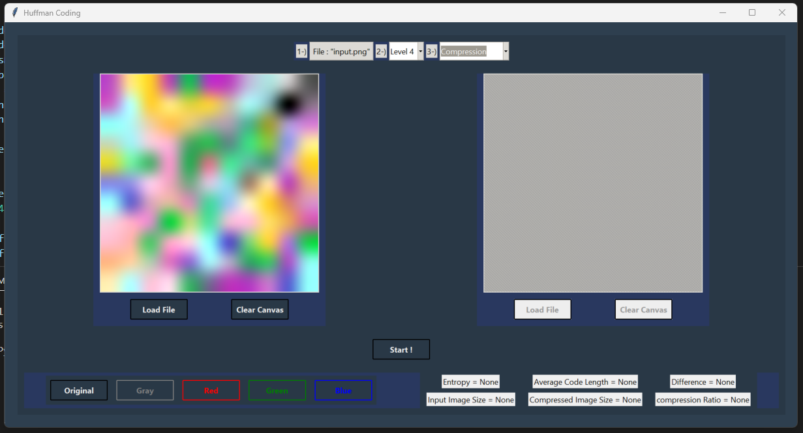

# Memory Management Simulation

This project is a Huffman Compression/Decompression tool built in Python with a Tkinter GUI. The program provides five levels of approach, allowing users to compress and decompress various types of files with increasing complexity

> Levels follow as;
* Text Files: Compress and decompress plain text files.
* Gray-Scale Images: Compress and decompress gray-scale images.
* Gray-Scale Images with Differences: Compress and decompress gray-scale images that have been modified with differences.
* Color Images: Compress and decompress color images.
* Color Images with Differences: Compress and decompress color images that have been modified with differences.
* With this tool, users can effectively reduce the size of their files while maintaining their quality. The program has been designed with usability in mind and includes a simple and intuitive interface.

## Environment & Setup

> This project held by, `python 3.9.0` !

Step by step to setup;

* 1. Clone the repository to your local machine. `git clone $repository_link`
> The anaconda is used for environmental setup, if you don't have anaconda, you can directly move to step 4.
* 2. Create a virtual environment. `conda create -n hfm python=3.9.0`
* 3. Activate the virtual environment. `conda activate hfm`
* 4. Install the requirements. `pip install -r requirements.txt`
* 5. Run the program. Checkout @Usage section.

## Usage

You can directly execute the program with `python main.py` command.

## Screenshot

> The screenshots are taken from the graphical usage application.

## To-Do

* [ ] Complete Levels.
* [ ] Resturcture the old-knowledged code. In terms of GUI and OOP.